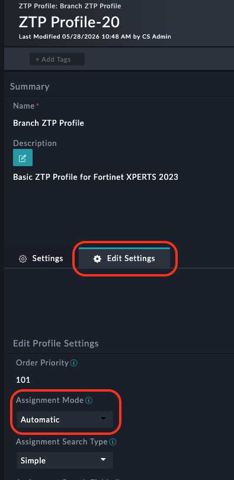
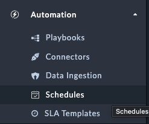

So far there has been a lot of touch! But we're _very_ close to zero now. In this section we'll see how to make the ZTP process truly zero touch.

---

## Modify the ZTP Profile

1. Navigate to **FortiManager > ZTP Profiles** and edit the **Branch ZTP Profile**.
2. Select the  **Edit Settings** tab
3. Change the **Assignment Mode** field to **Automatic**.
4. Exit the ztp profile

---
### Schedule the Device Synchronization
In this section, we’ll create a schedule so FortiSOAR automatically synchronizes unauthorized devices from FortiManager.

1. Navigate to **Automation > Schedules**.

    

1. Click **Create New Schedule**.
1. Fill out the schedule with the following details:

    - **Name**: `Retrieve Unauthorized Fortigates`
    - **Start Schedule**: `True` (enable the schedule)
    - **Playbook Reference**: `Synch All FMG Device DB Button`
    - **Schedule Frequency**: `Every X minutes`
    - **Interval**: `5` (can be adjusted as low as 1 minute)

1. Click **Save**.

This will automatically pull in new unauthorized devices every 5 minutes, eliminating the need for manual synchronization.

---
### Onboard Branch2
1. Login to the Branch2 FortiGate using the web interface
1. Follow the steps outlined [here]({}) to register the FortiGate to FortiManager
1. The device will appear as “Unauthorized” in FortiManager

---
### Watch the Automation in Action
Now you can observe the Fortigate being automatically:

- Discovered by the scheduled synchronization (within 5 minutes)
- Assigned the **Branch ZTP Profile** automatically
- Configured with all the settings from your ZTP profile

The entire process should complete without any manual intervention, achieving true zero-touch provisioning.

